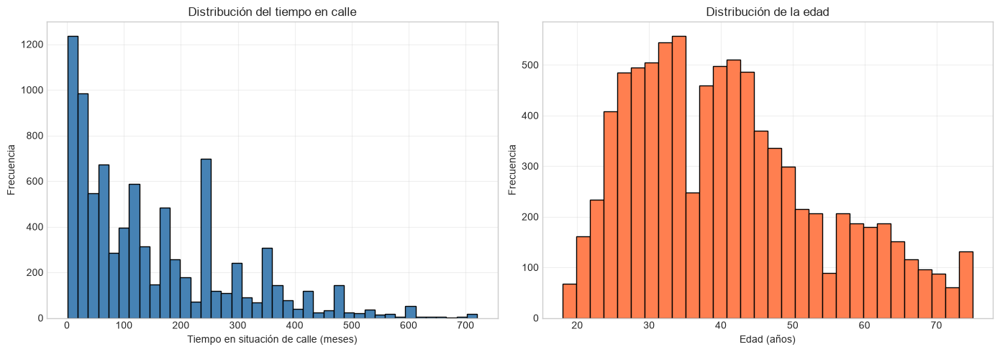
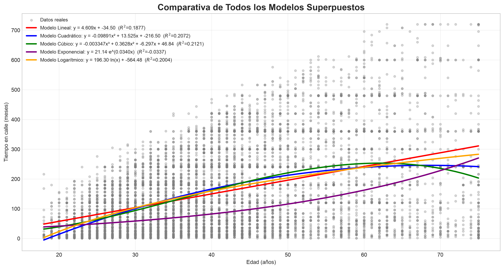

# 🏙️ Análisis Predictivo: Situación de Calle en Bogotá a través de Mínimos Cuadrados

**Universidad Militar Nueva Granada**  
*Programa de Matemáticas Aplicadas y Computacionales*


## 📌 Contexto y Propósito del Proyecto

El fenómeno de la habitabilidad de calle es una de las realidades sociales más complejas y urgentes de Bogotá. Este proyecto busca aportar una mirada objetiva y cuantitativa a este desafío, utilizando técnicas de álgebra lineal y ciencia de datos sobre los microdatos del *VIII Censo de Ciudadanos Habitantes de Calle (2024)*. 

Nuestro objetivo inicial es modelar la trayectoria temporal del fenómeno, analizando específicamente cómo interactúa la edad de los individuos con el tiempo que permanecen en situación de calle. Al traducir historias de vida en vectores de datos, buscamos sentar las bases para herramientas analíticas que ayuden a entender y mitigar esta realidad.

---

## 🧮 El Motor Analítico: De los Datos a la Geometría

La base matemática de este proyecto se fundamenta en la **proyección ortogonal y las ecuaciones normales**. Dado que los datos demográficos son ruidosos y sobredeterminados (tenemos muchas más observaciones que variables), es imposible encontrar una línea o curva que pase exactamente por todos los puntos. 

Para resolver esto, aplicamos el método de **Mínimos Cuadrados Ordinarios (MCO)**. Computacionalmente, construimos una matriz de diseño que proyecta el tiempo en calle de miles de ciudadanos hacia el subespacio de características más cercano, minimizando el error residual. 

> 📖 **Nota Técnica:** Si deseas explorar el desarrollo algebraico riguroso (desde la función de costo hasta la deducción analítica de $\hat{x} = (A^TA)^{-1}A^Tb$), puedes consultar nuestra [Demostración de Álgebra Lineal en los documentos del proyecto](./docs/Dem_Alg_Lin.md).

---

## 📈 Un Vistazo a los Hallazgos

A continuación, destacamos el comportamiento de los datos durante la fase de modelación bidimensional:

<div align="center">
  
  <p><em><strong>Fase 1:</strong> Análisis de dos variables —edad y tiempo en calle— luego de limpiar errores y datos atípicos.</em></p>
</div>

<br>

<div align="center">
  
  <p><em><strong>Fase 3:</strong> Proyecciones ortogonales resultantes. Comparativa visual de los 5 modelos evaluados (Lineal, Cuadrático, Cúbico, Exponencial y Logarítmico) derivados de la resolución del sistema matricial.</em></p>
</div>

---

## 📊 Resultados del Ajuste

Tras evaluar los cinco modelos mediante el coeficiente de determinación ($R^2$) y el RMSE, los resultados fueron:

| Modelo | $R^2$ aprox. | Rendimiento |
|---|---|---|
| **Cúbico** | ≈ 0.21 | 🥇 Mejor ajuste |
| **Cuadrático** | ≈ 0.21 | 🥈 Muy cercano |
| **Logarítmico** | — | ⚠️ Demasiado rígido |
| **Lineal** | — | ⚠️ Subestima la curva |
| **Exponencial** | < 0 | ❌ Descartado |

**Hallazgos clave:**

- 🥇 El **modelo cúbico** y el **cuadrático** lideran con $R^2 \approx 0.21$, capturando mejor la curvatura natural del fenómeno.
- ❌ El **modelo exponencial** fracasa ($R^2 < 0$), lo que demuestra que el tiempo en calle **no crece de forma multiplicativa** con la edad.
- 📌 **Interpretación crítica:** Que el mejor modelo solo explique el **21% de la varianza** implica que la edad, por sí sola, es insuficiente para modelar el fenómeno. El **79% restante** depende de variables multidimensionales (SPA, salud mental, redes de apoyo, nivel educativo) que este modelo bidimensional no captura.

---

## ⚠️ Limitaciones: La Complejidad del Factor Humano

En esta etapa inicial, el algoritmo se ha entrenado analizando **únicamente dos dimensiones**:

1. `Edad` (Variable Independiente)
2. `Tiempo en situación de calle` (Variable Dependiente)

Entendemos profundamente que una realidad social atravesada por carencias sistémicas, rupturas familiares y problemas de salud mental **no puede modelarse con precisión usando solo dos variables**. La trayectoria de la vida en calle no es una línea recta. Este modelo actual debe interpretarse como un ejercicio de aproximación topológica y un punto de partida exploratorio, más no como una conclusión definitiva sobre las causas del fenómeno.

---

## 🚀 Visión a Futuro y Política Pública

Para que los números se traduzcan en impacto social real, las siguientes fases de investigación contemplan:

- **🧠 Modelación Multivariada:** Evolucionar de un modelo bidimensional a uno multidimensional, integrando determinantes cruciales como el género, el nivel educativo previo, el acceso a sistemas de salud y otros factores contenidos dentro de la encuesta.
- **🚨 Índice de Vulnerabilidad:** Diseñar un indicador compuesto enfocado en factores de riesgo críticos, con especial atención en el consumo de Sustancias Psicoactivas (SPA) y la carencia de redes de apoyo.
- **🏛️ Herramienta de Intervención:** Traducir estos hallazgos analíticos en tableros de control para las entidades de integración social del distrito. Identificar matemáticamente los picos de riesgo permite focalizar los recursos de manera temprana, buscando siempre **dignificar la vida humana** y facilitar rutas efectivas de reintegración.

---

## 📂 Estructura del Repositorio

```text
📦 minimos_cuadrados_Habitantes_calle_Bog
 ┣ 📂 data/
 ┃ ┣ 📂 raw/                          # Microdatos originales (Fuente: datos.gov.co)
 ┃ ┗ 📂 processed/                    # Datos limpios y matrices de modelación
 ┣ 📂 notebooks/                      # Flujo de trabajo
 ┃ ┣ 📓 01_exploracion.ipynb          # Carga, limpieza y construcción de variables
 ┃ ┣ 📓 02_modelado.ipynb             # Ajuste por Mínimos Cuadrados
 ┃ ┗ 📓 03_analisis.ipynb             # Visualización y análisis de resultados
 ┣ 📂 outputs/
 ┃ ┣ 📂 figuras/                      # Gráficas comparativas
 ┃ ┗ 📂 tablas/                       # CSV con ajustes exportados
 ┣ 📂 docs/                           # Documentación extendida
 ┃ ┣ 📄 Dem_Alg_Lin.md                # Demostración algebraica MCO
 ┃ ┣ 📄 consideraciones_eticas.md     # Lineamientos éticos
 ┃ ┗ 📄 fuente_datos.md               # Origen de los datos
 ┣ 📜 requirements.txt                # Dependencias del entorno
 ┗ 📜 README.md                       # Este archivo
```

---

## ⚙️ Instalación

Para ejecutar este proyecto de manera local, asegúrate de tener Python 3 instalado y ejecuta los siguientes comandos en tu terminal:

```bash
# 1. Clonar el repositorio
git clone https://github.com/eljaimejia/minimos_cuadrados_Habitantes_calle_Bog.git
cd minimos_cuadrados_Habitantes_calle_Bog

# 2. Crear y activar un entorno virtual (recomendado)
python -m venv venv
source venv/bin/activate  # En Windows usa: venv\Scripts\activate

# 3. Instalar las dependencias requeridas
pip install -r requirements.txt
```

---

## 🧑‍🤝‍🧑 Autores

* Kevin Wilder Cardozo V.
* David Antonio Mora F.
* Juan Peláez

---

**Universidad Militar Nueva Granada — Matemáticas Aplicadas y Computacionales**